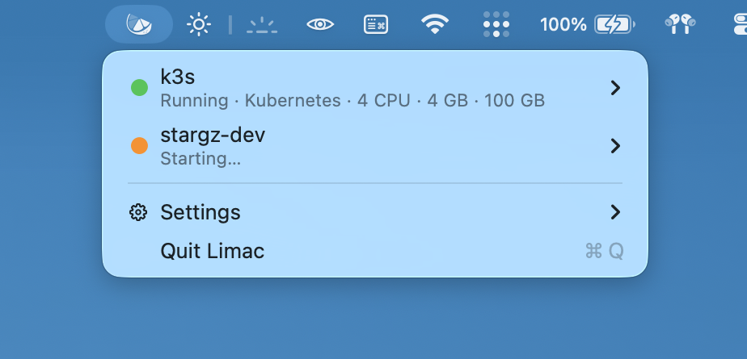
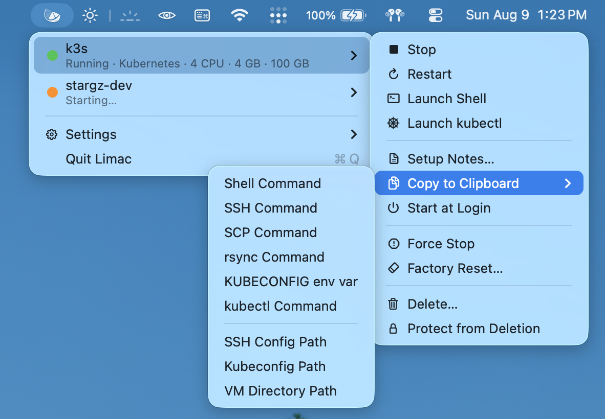

<div align="center">
  
  <h1>Limac</h1>
  <p><strong>Control your <a href="https://github.com/lima-vm/lima">Lima</a> VMs from the macOS menu bar.</strong></p>
  <p>
    
    
    
  </p>
</div>

Glance at the menu bar to see which VMs are running. Click to start, stop, or
open a shell. Limac wraps `limactl` and nothing else: a VM you start from the
terminal appears in the menu, and every action Limac takes is a `limactl`
command you could type yourself.

<!-- TODO: replace placeholders with real captures -->

| VM list | VM controls |
| :---: | :---: |
| *coming soon* | *coming soon* |
<!--
|  |  |
-->

## Features

- See what's running at a glance. The icon is green when a VM is running and
  gray when none are, and the menu updates the moment a VM changes, even one
  you started from a terminal.
- Start, stop, or restart a VM in one click.
- Open a shell in your terminal: Ghostty, iTerm2, WezTerm, Alacritty, or
  Terminal.
- Use Kubernetes VMs right away: launch a `kubectl` terminal with
  `KUBECONFIG` set, or copy the kubeconfig.
- Smaller conveniences live in each VM's menu: copy `ssh` commands, read
  Lima's setup notes, and start VMs at login.

## Installation

There is no packaged release yet; build from source. You need macOS 14 or
later, a Swift toolchain (Xcode 15 or the Command Line Tools), and Lima 2.0
or later on your `PATH` (`brew install lima`).

```sh
git clone https://github.com/ahmetb/limac
cd limac
swift run
```

A signed app bundle and a Homebrew cask will follow.

## Scope

Limac is a minimal app to control the Lima VMs you already have, so don't
expect a full feature set. It does not create VMs or manage containers, and
if `limactl` doesn't report something, Limac doesn't show it. Product and
design docs live in [docs/](docs/).

## License

[MIT](LICENSE). Limac is an independent project, not affiliated with the
Lima project.
